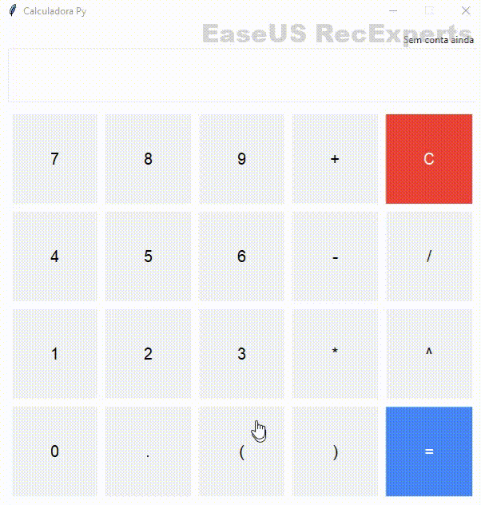
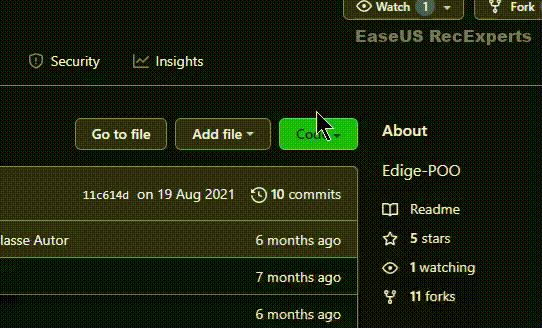

# Simple Calculator Python
<h2 dir="auto"><a id="user-content--funcionalidades-do-projeto" class="anchor" aria-hidden="true" href="#-funcionalidades-do-projeto"><svg class="octicon octicon-link" viewBox="0 0 16 16" version="1.1" width="16" height="16" aria-hidden="true"><path fill-rule="evenodd" d="M7.775 3.275a.75.75 0 001.06 1.06l1.25-1.25a2 2 0 112.83 2.83l-2.5 2.5a2 2 0 01-2.83 0 .75.75 0 00-1.06 1.06 3.5 3.5 0 004.95 0l2.5-2.5a3.5 3.5 0 00-4.95-4.95l-1.25 1.25zm-4.69 9.64a2 2 0 010-2.83l2.5-2.5a2 2 0 012.83 0 .75.75 0 001.06-1.06 3.5 3.5 0 00-4.95 0l-2.5 2.5a3.5 3.5 0 004.95 4.95l1.25-1.25a.75.75 0 00-1.06-1.06l-1.25 1.25a2 2 0 01-2.83 0z"></path></svg></a><g-emoji class="g-emoji" alias="hammer" fallback-src="https://github.githubassets.com/images/icons/emoji/unicode/1f528.png">🔨</g-emoji> Funcionalidades do projeto</h2>

Uma calculadora simples e funcional, que deve ser capaz de executar operações matemáticas simples, e podemos utilzar tanto o teclado virtual, quanto o teclado 
próprio do sistema.
Também foi implantado o sistema unittest para testes funcionais na aplicação e futura correções de bugs, tudo claro, em caráter de aprendizado.

  

  

  

Calculadora feita durante o aprendizado de design patterns (Padrão de projeto de software) 

<h2 dir="auto"><a id="user-content-️-técnicas-e-tecnologias-utilizadas" class="anchor" aria-hidden="true" href="#️-técnicas-e-tecnologias-utilizadas"><svg class="octicon octicon-link" viewBox="0 0 16 16" version="1.1" width="16" height="16" aria-hidden="true"><path fill-rule="evenodd" d="M7.775 3.275a.75.75 0 001.06 1.06l1.25-1.25a2 2 0 112.83 2.83l-2.5 2.5a2 2 0 01-2.83 0 .75.75 0 00-1.06 1.06 3.5 3.5 0 004.95 0l2.5-2.5a3.5 3.5 0 00-4.95-4.95l-1.25 1.25zm-4.69 9.64a2 2 0 010-2.83l2.5-2.5a2 2 0 012.83 0 .75.75 0 001.06-1.06 3.5 3.5 0 00-4.95 0l-2.5 2.5a3.5 3.5 0 004.95 4.95l1.25-1.25a.75.75 0 00-1.06-1.06l-1.25 1.25a2 2 0 01-2.83 0z"></path></svg></a><g-emoji class="g-emoji" alias="heavy_check_mark" fallback-src="https://github.githubassets.com/images/icons/emoji/unicode/2714.png">✔️</g-emoji> Técnicas e tecnologias utilizadas</h2>
<ul>
  <li>Tkinter</li>
  <li>Match</li>
  <li>RE</li>
  <li>typing</li>
  <li>unittest</li>
 </ul>
 
 

  Para execução, baixe o aquivo zip, ou clone o repositório 
  

  

   
   
